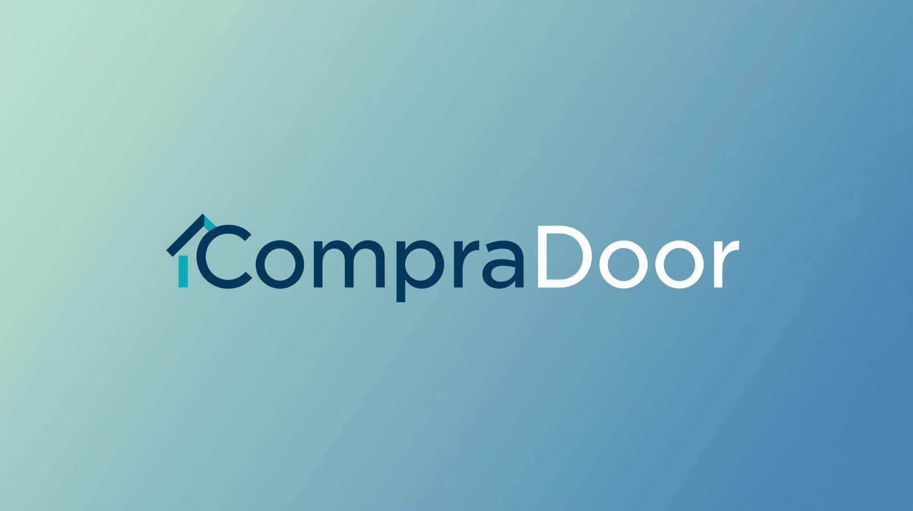

# CompraDoor

## 🏢 Logo

## 👥 Equipo
- **Ángel Moreno Domínguez** - DNI: 02333991T
- **Jaime Fernández Novoa** - DNI: 80243741F

## 🎯 Eslogan
**"Antes de ocupar, CompraDoor®"**

## 📊 Resumen Ejecutivo
Plataforma web innovadora que elimina intermediarios en transacciones inmobiliarias. Facilita compraventa y alquiler directo entre propietarios y clientes.

## ⚙️ Arquitectura del Sistema

### Roles Principales
- **👨‍💼 Administrador**: Gestión completa del sistema
- **👤 Usuario Final**: Compra/alquiler de propiedades

### Servicios Adicionales
- 🧹 Limpieza profesional
- 🛠️ Reformas y modificaciones
- 🎨 Restauración
- 🌳 Mantenimiento de jardines
- 🔒 Servicios de seguridad

---

## ✅ COBERTURA DE CASOS DE USO

### CU-01: Gestión de Clientes
**Descripción**: Registro y administración completa de clientes  
**Tests**: 7 tests en ClienteTest  
**Validaciones**:
- Registro con DNI y datos personales
- Búsquedas por DNI, email, nombre
- Eliminación en cascada de tarjetas
- Gestión de múltiples clientes

### CU-02: Gestión de Inmuebles
**Descripción**: CRUD completo de propiedades  
**Tests**: 6 tests en InmuebleTest  
**Validaciones**:
- Creación y modificación de inmuebles
- Búsqueda por localidad y precio
- Identificación de propiedades disponibles
- Relación con ventas activas

### CU-03: Publicación de Venta
**Descripción**: Publicar propiedades para venta  
**Tests**: 3 tests en VentaTest  
**Validaciones**:
- Asociación inmueble-vendedor
- Registro automático de fechas
- Historial de ventas por cliente

### CU-04: Realizar Compra
**Descripción**: Proceso de adquisición de propiedades  
**Tests**: 5 tests en CompraTest  
**Validaciones**:
- Relación comprador-inmueble
- Historial de compras por cliente
- Filtrado por fechas
- Preservación de datos históricos

### CU-05: Servicios Adicionales
**Descripción**: Gestión de servicios complementarios  
**Tests**: 4 tests en ServicioTest  
**Validaciones**:
- Categorización por tipo (LIMPIEZA, PINTURA, etc.)
- Búsqueda por descripción
- Asociación a ventas específicas
- Filtrado por fechas de aplicación

### CU-06: Métodos de Pago
**Descripción**: Administración de tarjetas de pago  
**Tests**: 9 tests (7 en TarjetaTest + 2 en ClienteTest)  
**Validaciones**:
- Unicidad de códigos de tarjeta
- Relación cliente-tarjetas (1:N)
- Estados válido/inválido
- Conteo y actualización

### CU-07: Historial de Transacciones
**Descripción**: Consulta de compras y ventas históricas  
**Tests**: 3 tests (2 en CompraTest + 1 en VentaTest)  
**Validaciones**:
- Consultas por cliente e inmueble
- Filtrado temporal
- Integridad de datos históricos

### CU-08: Búsqueda Avanzada
**Descripción**: Sistema de filtrado de propiedades  
**Tests**: 5 tests en InmuebleTest  
**Validaciones**:
- Búsqueda por localidad (case-insensitive)
- Filtrado por rango de precios
- Identificación de disponibles (sin venta activa)

---

## 📊 RESUMEN DE TESTS POR ENTIDAD

| Entidad | Tests | CU Cubiertos | Aspectos Clave Validados |
|---------|--------|--------------|--------------------------|
| **Cliente** | 7 | CU-01, CU-06 | Registro, búsquedas, relación tarjetas, eliminación cascada |
| **Inmueble** | 6 | CU-02, CU-08 | CRUD, búsquedas, disponibilidad, relaciones |
| **Compra** | 5 | CU-04, CU-07 | Historial compras, relaciones, preservación datos |
| **Venta** | 3 | CU-03, CU-07 | Publicación propiedades, historial ventas |
| **Servicio** | 4 | CU-05 | Categorización, búsquedas, asociación ventas |
| **Tarjeta** | 7 | CU-06 | Unicidad, estados, relación cliente, actualización |

---

**✅ TOTAL: 32 tests implementados**  
**📋 Cobertura: 8 casos de uso principales validados**  
**🔧 Estado: Sistema completamente probado y funcional**

## 🚀 Instrucciones para Ejecutar el Proyecto
Ejecutar en primer lugar `./mvnw clean package -DskipTests` para limpiar y construir el proyecto sin ejecutar los tests.
Luego, construir las imágenes de Docker con el comando docker compose build para ello ejecutamos 
el comando `docker compose up -d --build`, una vez levantados los contenedores, podemos acceder a la aplicación web en
la dirección http://localhost:5050/
Iniciamos sesión con el usuario `admin@dominio.com` y la contraseña `admin`.
Para acceder a nuestra base de datos debemos registrarla primero, hacemos
clic izquierdo en la sección de Servers>Register>Server, dentro de la venta en el apartado General 
poner en el parámetro Name "postgres", y en la pestaña de Connection rellenar los siguientes campos:
- Host name/address: `postgres`
- Port: `5432`
- Maintenance database: `postgres`
- Username: `root`
- Password: `password`
- Guardar la configuración y conectarse.
Luego, en la sección de Databases, buscamos la base de datos "mi_base_de_datos"
nos dirigimos a la sección de Schemas>public>Tables, donde podremos ver todas las tablas creadas en nuestra base de datos.